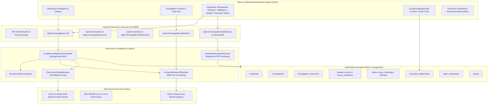

# MERIDIAN — Workspace Data Flow & Architecture

```mermaid
flowchart TD
    subgraph UI ["Next.js Institutional Workspace (/app & /demo)"]
        Nav["Workspace Navigation & Sidebar"]
        InvHeader["Investigation Header & Ticker Bar"]
        Tabs["Subsystem Workspaces: Research, Intelligence, Debate, Financials, Report"]
        GraphComponent["LivingKnowledgeGraph (Canvas / React Flow)"]
        DossierView["19-Section Institutional Investment Memorandum"]
    end

    subgraph API ["FastAPI Autonomous Service (Port 8000)"]
        AuthMiddleware["JWT Authentication & Tenant Scoping"]
        InvRouter["/api/v1/investigations API"]
        CompRouter["/api/v1/companies & /api/v1/companies/discover"]
        DebateRouter["/api/v1/scenarios & /api/v1/investigations/{id}/society"]
        StockRouter["/api/v1/investigations/{id}/stock"]
        DossierRouter["/api/v1/investigations/{id}/dossier & /dossier/pdf"]
    end

    subgraph Core ["Autonomous Intelligence Engines"]
        Resolver["CompanyResearchResolver (Multi-Tier Grounding)"]
        Orchestrator["DurableInvestigationOrchestrator (Background DAG)"]
        Decomposer["DynamicTaskDecomposer"]
        DebateEngine["ClaimDrivenDebateEngine (Anti-Majority-Rule)"]
        DossierGen["InvestmentDossierGenerator (ReportLab PDF Synthesis)"]
    end

    subgraph DB ["Authoritative Storage (SQLite / PostgreSQL)"]
        CompanyTable["companies"]
        InvTable["investigations"]
        ExecTable["investigation_executions"]
        EvidenceTable["evidence_items & source_snapshots"]
        ClaimTable["claims, claim_challenges, rebuttals"]
        RelTable["corporate_relationships"]
        InteractionTable["agent_interactions"]
        ReportTable["reports"]
    end

    subgraph External ["Real-World External Providers"]
        YFinance["Yahoo Finance (Live Market Equities)"]
        SEC["SEC EDGAR (10-K & 10-Q Disclosures)"]
        LiteLLM["LiteLLM Unified Multi-Model Provider Router"]
    end

    Nav --> InvRouter
    InvHeader --> StockRouter
    StockRouter --> Resolver
    Resolver --> YFinance
    InvRouter --> Orchestrator
    Orchestrator --> Decomposer
    Orchestrator --> Resolver
    Orchestrator --> DebateEngine
    DebateEngine --> LiteLLM
    Orchestrator --> DB
    DossierRouter --> DossierGen
    DossierGen --> DB
    GraphComponent --> RelTable
    Tabs --> InvRouter
    Tabs --> DossierRouter
```
